# Failover Methods & Service-Level Objectives (SLO)

A walk-through of the fourteen 3-tier reference architectures in [out/](out/), the
**failover method** each one uses, and the **availability SLO / RTO / RPO** you
can realistically target with it.

> **Building on managed PaaS instead of VMs?** See the companion
> [PaaS Failover Methods](paas-failover-methods.md): the same story retold with
> App Service, Azure SQL, Cosmos DB and Front Door, where several of these rungs
> collapse into a SKU tier and a config toggle.

> The numbers below are **illustrative design targets**, not contractual SLAs.
> Your actual SLO is bounded by each cloud's component SLAs (compute, load
> balancer, database, DNS) and your operational maturity. Treat them as a
> relative ladder: each step buys more resilience at more cost and complexity.

---

## Key terms

| Term | Meaning |
|------|---------|
| **SLO** | Service-Level Objective: the availability you *aim* to deliver (e.g. 99.99%). |
| **SLA** | Service-Level Agreement: the contractual promise (usually a notch below your SLO). |
| **RTO** | Recovery Time Objective: how long the app can be **down** during a failure before it's back. |
| **RPO** | Recovery Point Objective: how much **data** (measured in time) you can afford to lose. |
| **Failover** | Shifting traffic/work from a failed component to a healthy one. |
| **Sync replication** | Data committed to replicas before acknowledging → RPO ≈ 0, but latency-bound (same metro / AZ). |
| **Async replication** | Data shipped to replicas after commit → RPO > 0 (seconds to minutes), works over long distance. |

### Availability "nines" → downtime budget

| SLO | Downtime / year | Downtime / month |
|-----|-----------------|------------------|
| 99.0%   | 3.65 days   | 7.3 hours  |
| 99.9%   | 8.77 hours  | 43.8 min   |
| 99.95%  | 4.38 hours  | 21.9 min   |
| 99.99%  | 52.6 min    | 4.38 min   |
| 99.999% | 5.26 min    | 26 sec     |

### Availability math (why redundancy helps)

- **Serial dependency** (every tier must be up): multiply the tiers →
  `A_total = A_web × A_app × A_db`. More tiers in series *lowers* availability.
- **Parallel redundancy** (N identical instances, any one suffices): the *failure*
  probabilities multiply → `A = 1 − (1 − A_instance)^N`. This is where AZs and
  regions earn their nines.

### The failover ladder (DR patterns)

From cheapest/slowest to most expensive/fastest, each rung has its own diagram:

1. **Backup & Restore** (#1): rebuild from backups after an outage. Slow RTO, lossy RPO.
2. **Pilot Light** (#2): core data replicated to a second region, compute dormant;
   provision and scale up on failover.
3. **Warm Standby** (#3): a smaller always-on copy in the DR region; scale up and cut over.
4. **Hot Standby / Active-Passive** (#4-#6): a full standby with automatic,
   health-probe-based failover (across regions in #4, locally in #5/#6).
5. **Active / Active** (#7, #10, #12, #13): all sites serve traffic; a "failover" is
   just removing an unhealthy endpoint, effectively zero RTO.

Two orthogonal choices sit alongside this ladder: the **data strategy**
(single-writer read replicas, #9, vs multi-writer active/active) and
**blast-radius isolation** (cell-based / shuffle sharding, #14).

### How to read the diagrams

- **Solid arrows** = live traffic. **Dashed arrows** = replication / failover paths.
- **Blue** = active, **grey** = passive/standby, **amber** = disaster-recovery site.
- A **dashed grey box** (e.g. #2) marks **dormant compute**, provisioned only on failover.
- Load balancers take traffic **in on top** and send it **out the side**; the
  zone-redundant LBs fan out to every AZ.
- Flow in every stack: `Front LB → Web → Internal LB → App → Database`.

---

## 1 · Active (single site)

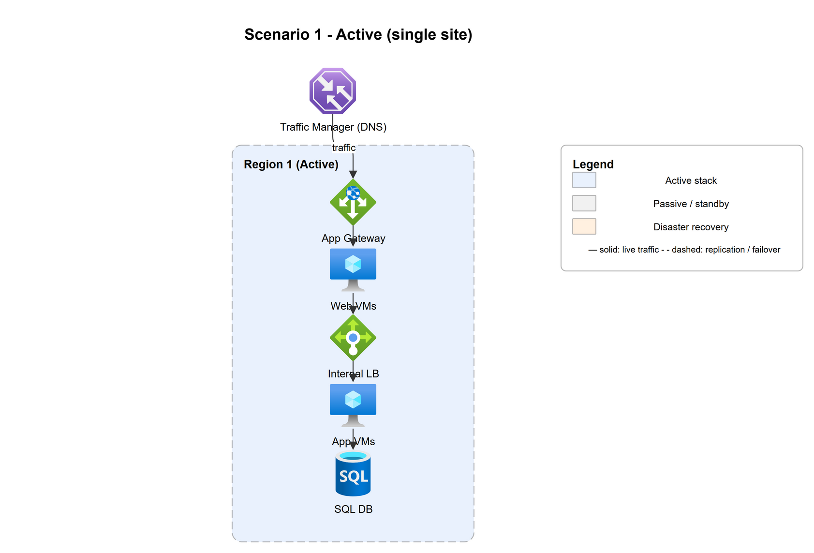

A single full stack in one region. **No redundancy**, the baseline.

| Failover method | RTO | RPO | Target SLO |
|-----------------|-----|-----|-----------|
| **Backup & Restore**: redeploy stack and restore the DB from backup. Entirely manual. | Hours (rebuild + restore) | Last backup: 1-24 h | **~99.9%** (capped by single instances) |

**When to use:** dev/test, internal tools, anything where hours of downtime and
some data loss are acceptable. Any single failure (VM, AZ, region) is an outage.

---

## 2 · Active + DR: Pilot Light

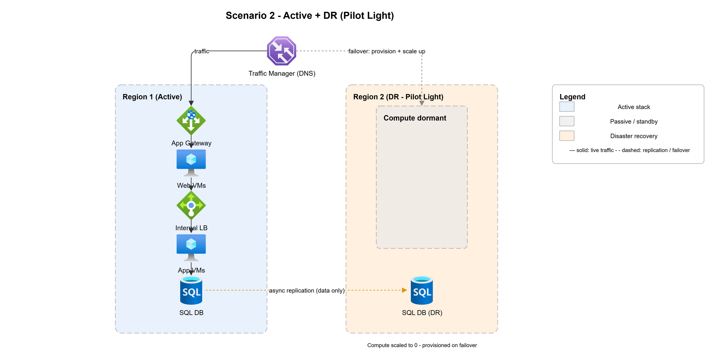

Primary region serves traffic; the **DR region keeps only the data tier live**
(async-replicated). Compute is **dormant / scaled to zero** and is provisioned and
scaled up during failover. The cheapest way to hold a real second region.

| Failover method | RTO | RPO | Target SLO |
|-----------------|-----|-----|-----------|
| **Pilot Light**: on failover, spin up compute in the DR region, promote the replicated DB, re-point DNS. | ~30 min to a few hours (provision + scale) | Seconds to minutes (async lag) | **~99.9%** app, plus regional disaster protection |

**When to use:** you must survive losing a region and want the lowest standing cost,
and can tolerate a mostly-scripted, tens-of-minutes cutover.

---

## 3 · Active + DR: Warm Standby

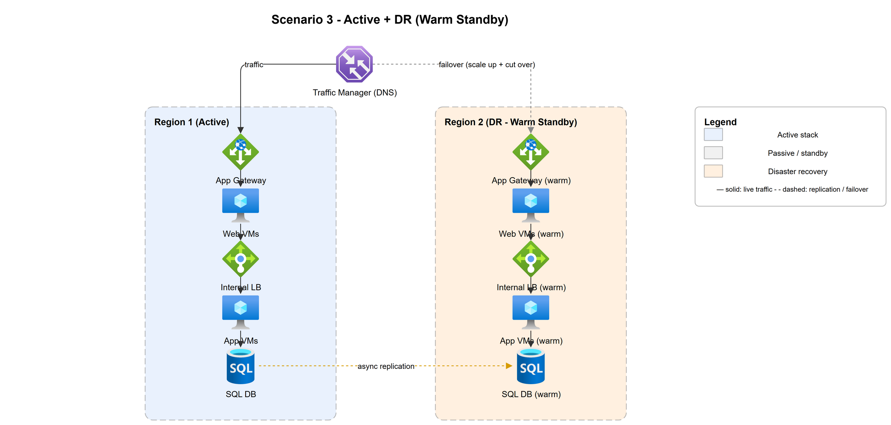

Like Pilot Light, but the DR region runs a **smaller, always-on copy** of the full
stack. On failover you scale it up and cut traffic over via DNS, faster than
starting compute from cold.

| Failover method | RTO | RPO | Target SLO |
|-----------------|-----|-----|-----------|
| **Warm Standby**: DNS regional failover, scale up the running DR stack, promote the DR database. | 15 min to ~1 h (scale up + cut over) | Seconds to minutes (async lag) | **~99.9%** app, plus regional disaster protection |

**When to use:** you need a quicker regional recovery than Pilot Light and can pay
to keep a slimmed-down stack running all the time.

---

## 4 · Active + DR: Automatic Hot Standby

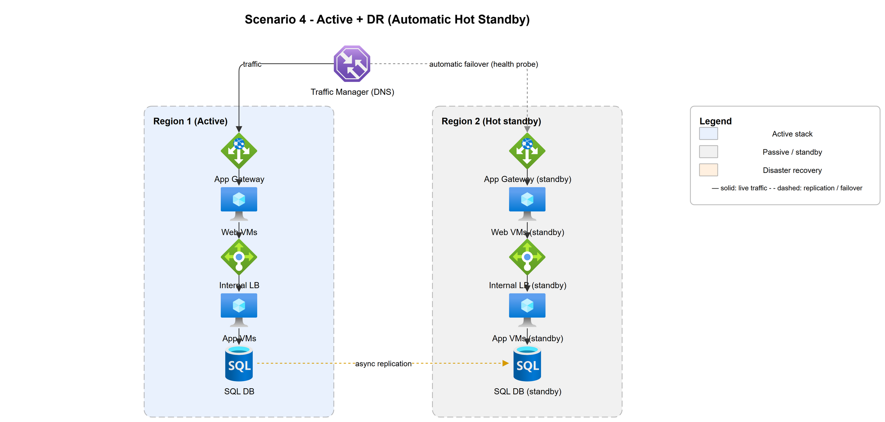

A **full standby stack in a second region**, kept current by async replication, with
**automatic** health-probe-based failover from the global load balancer, with no
manual promotion step.

| Failover method | RTO | RPO | Target SLO |
|-----------------|-----|-----|-----------|
| **Hot Standby (active/passive across regions)**: health probe auto-fails traffic over to the standby region. | Seconds to a few minutes (automatic) | Seconds to minutes (async lag) | **~99.95%** |

**When to use:** you need automatic recovery from a whole-region loss without waiting
for a human, but don't need (or can't afford the write-conflict handling of) full
active/active.

---

## 5 · Active + Passive (local HA)

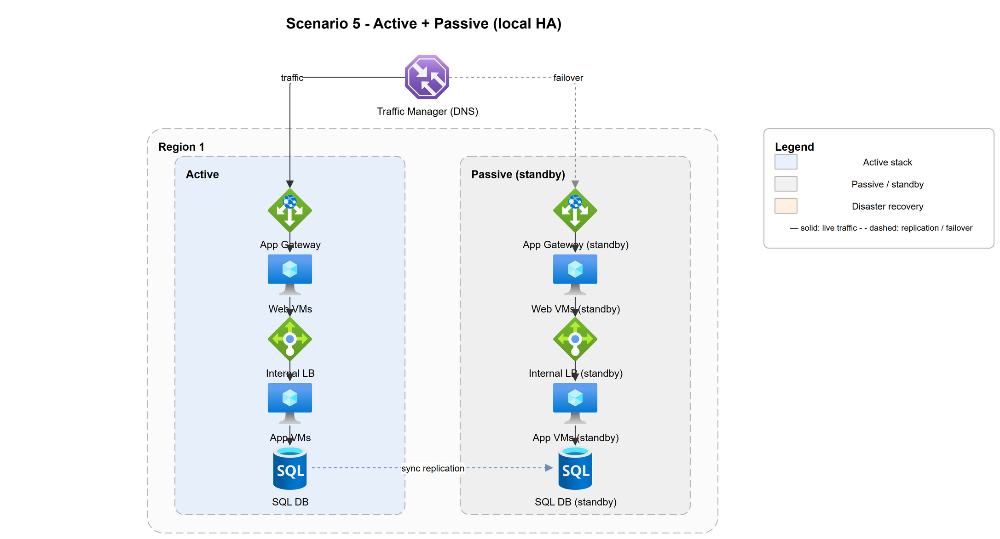

Two stacks in the **same region**: one active, one hot standby. **Synchronous**
replication keeps the standby identical; failover is **automatic** on health-probe
failure.

| Failover method | RTO | RPO | Target SLO |
|-----------------|-----|-----|-----------|
| **Active/Passive (hot standby)**: LB / cluster health probe auto-promotes the passive node. | Seconds to a few minutes (automatic) | ≈ 0 (sync) | **~99.95%** |

**When to use:** you need automatic recovery from instance/stack failure with no
data loss, but a single region is acceptable. Does **not** protect against a
whole-region outage.

---

## 6 · Active + Passive + DR

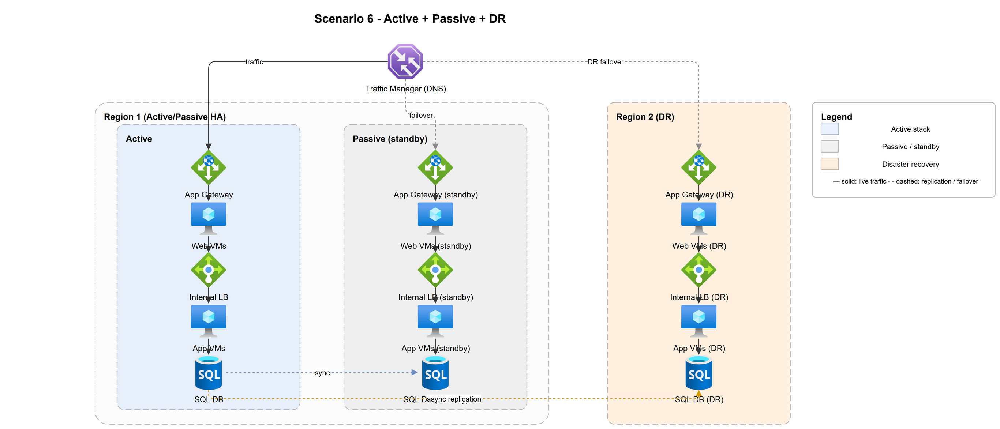

Combines local automatic HA (active/passive, sync) **with** a DR region (async).
Two independent layers of protection.

| Failover scope | Method | RTO | RPO |
|----------------|--------|-----|-----|
| Local (instance/stack) | Active/Passive auto-failover (sync) | Seconds to minutes | ≈ 0 |
| Regional (whole region lost) | Warm-standby DR, DNS failover | Minutes | Seconds |

**Target SLO: ~99.95%** for everyday failures, with regional-disaster coverage.

**When to use:** business apps that need automatic local HA *and* a documented
regional recovery path, without paying for full multi-region active/active.

---

## 7 · Active across 3 Availability Zones (1 region)

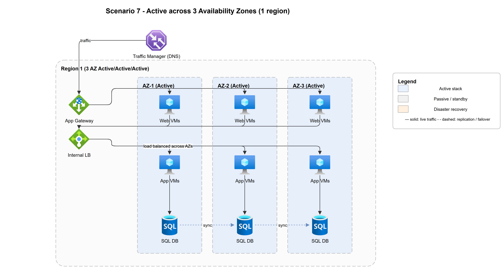

One region, three AZs, **all active**. Zone-redundant load balancers spread the
web and app tiers across AZs; the database replicates **synchronously** between
zones. A zone failure is handled automatically: the LB just stops sending to it.

| Failover method | RTO | RPO | Target SLO |
|-----------------|-----|-----|-----------|
| **Active/Active across zones**: health-based LB removal of the failed AZ; no promotion step. | Seconds (automatic) | ≈ 0 (sync across AZ) | **~99.99%** |

**When to use:** the standard production baseline in a single region. Survives a
full-AZ outage with near-zero impact. Still exposed to a *region-wide* failure.

---

## 8 · 3 AZ Active + DR region (also 3 AZ active)

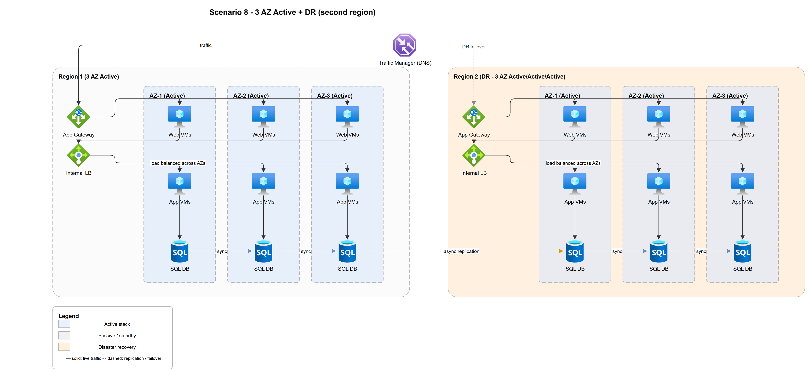

Scenario 7, plus a **second region that is itself a full 3-AZ active deployment**
held as DR (amber). Intra-region failures are absorbed automatically; a whole-region
loss triggers a regional failover with the DR region already warm.

| Failover scope | Method | RTO | RPO |
|----------------|--------|-----|-----|
| Zone failure | Active/Active across AZ (auto) | Seconds | ≈ 0 |
| Region failure | DNS failover to warm 3-AZ DR region | Minutes | Seconds (async cross-region) |

**Target SLO: ~99.99%** with strong regional-disaster protection (DR is fully
zone-redundant, so it's not a degraded fallback).

**When to use:** tier-1 apps that need both everyday zone resilience and a
credible, capacity-matched recovery region.

---

## 9 · Single-writer, global read replicas (write-global / read-local)

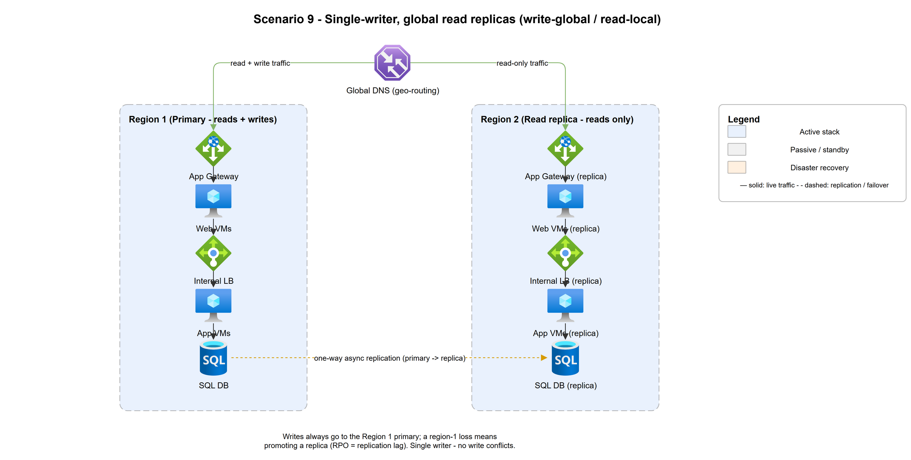

Multiple regions serve **read** traffic locally, but **all writes go to a single
primary region**. Data flows **one-way** (primary → replicas, async). This is the
common, conflict-free alternative to active/active: you get read-scaling and
read-local latency **without** multi-master write conflicts.

| Failover method | RTO | RPO | Target SLO |
|-----------------|-----|-----|-----------|
| **Single-writer + read replicas**: reads survive a region loss instantly; a primary loss requires **promoting a replica** to writer. | Reads: near-zero · Writes: minutes (promote replica) | Seconds (replication lag) | **~99.99%** for reads |

**Caveat:** losing the primary region means a write outage until a replica is
promoted, and any un-replicated writes are lost (RPO = lag). No conflict resolution
is needed because there is only ever one writer.

**When to use:** read-heavy global apps (catalogs, feeds, dashboards) that want
low-latency local reads and regional read resilience, but can keep a single write
region.

---

## 10 · Multi-region Active/Active (3 AZ per region)

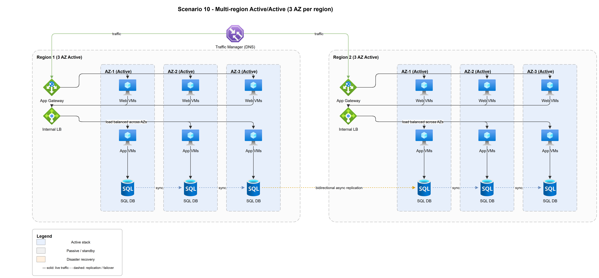

Two regions, **both serving live traffic**, each internally 3-AZ active. A global
load balancer distributes users; data replicates **bidirectionally (async)**.
There is no "failover" in the classic sense: a failed region is simply removed
from rotation.

| Failover method | RTO | RPO | Target SLO |
|-----------------|-----|-----|-----------|
| **Active/Active multi-site**: global LB drops the unhealthy region; surviving region carries the load. | Near-zero (sub-minute) | Seconds (async lag) | **~99.99%-99.999%** |

**Caveat:** bidirectional async replication means **write conflicts are possible**,
so you need conflict resolution (last-writer-wins, CRDTs, partitioned ownership)
or a single-writer model (see #9). Capacity-plan so one region can absorb 100% of load.

**When to use:** global, latency-sensitive, high-revenue services that cannot
tolerate a regional outage even briefly.

---

## 11 · Azure 3 AZ Active + DR in AWS: cross-cloud

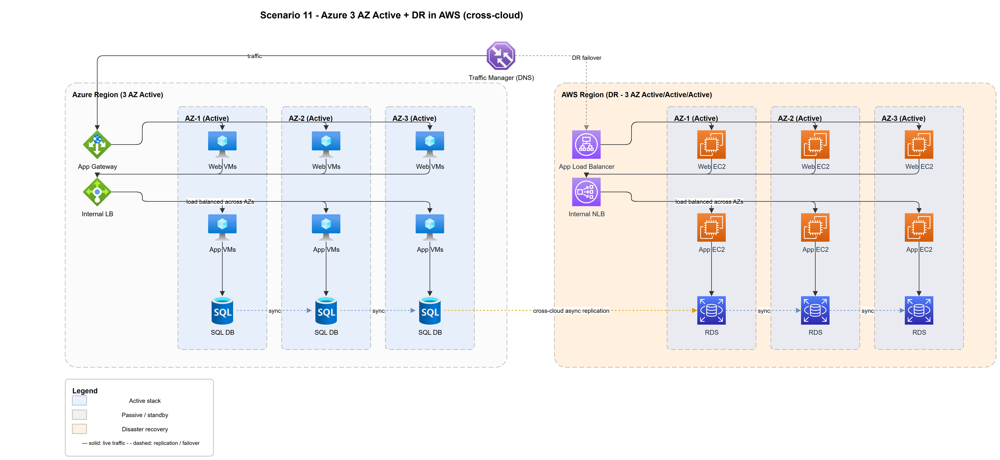

Same shape as #8, but the DR region lives in a **different cloud provider**
(Azure primary → AWS DR). Adds protection against a **provider-wide** outage or
account-level issue, at the cost of cross-cloud data replication and dual tooling.

| Failover scope | Method | RTO | RPO |
|----------------|--------|-----|-----|
| Zone failure (Azure) | Active/Active across AZ (auto) | Seconds | ≈ 0 |
| Cloud/region failure | Cross-cloud failover to AWS 3-AZ DR | Minutes | Seconds (cross-cloud async) |

**Target SLO: ~99.99%**, plus resilience to a single-provider catastrophe.

**When to use:** regulatory or risk requirements demand independence from any one
cloud provider. Expect higher network egress cost, latency, and operational
complexity (two platforms, two skill sets, data-sovereignty review).

---

## 12 · Active/Active across Azure + AWS (3 AZ each)

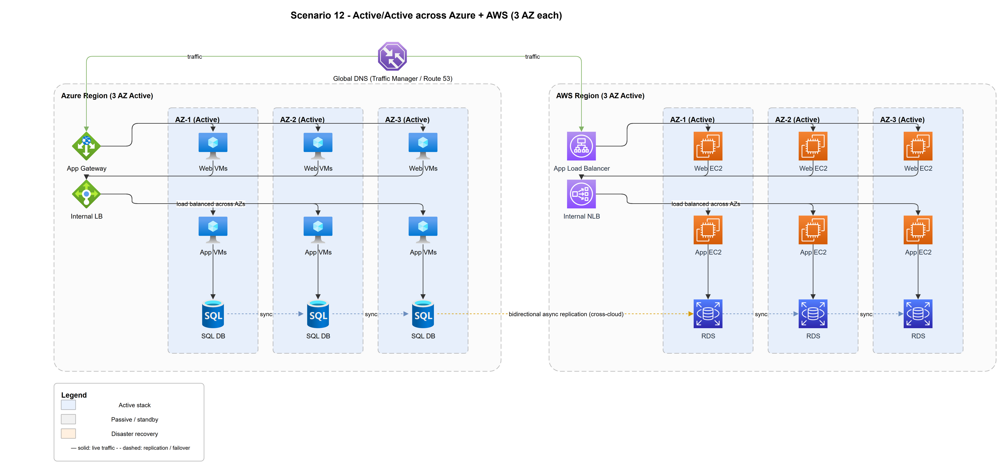

Scenario 10 spanning **two different clouds**: a 3-AZ active region in Azure and a
3-AZ active region in AWS, both live behind a global DNS. Survives the loss of an
entire cloud provider with no failover event.

| Failover method | RTO | RPO | Target SLO |
|-----------------|-----|-----|-----------|
| **Active/Active multi-cloud**: global DNS removes the failed cloud; the other serves everything. | Near-zero | Seconds (cross-cloud async) | **~99.999%** |

**Caveat:** all the multi-region conflict concerns of #10, **plus** cross-cloud
network latency, egress cost, and the challenge of keeping two platform stacks
truly equivalent (IAM, networking, managed-DB semantics differ).

**When to use:** the rare app where a single-provider outage is an unacceptable
business risk and the cost of true multi-cloud parity is justified.

---

## 13 · Multi-cloud, multi-region, all active

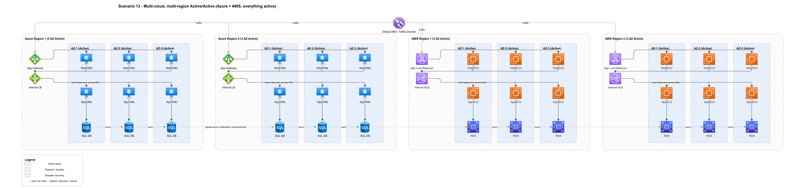

The maximum-resilience topology: **two active regions in each of Azure and AWS**
(four active 3-AZ deployments), everything live, global DNS distribution, and
global async replication across all of them.

| Failover method | RTO | RPO | Target SLO |
|-----------------|-----|-----|-----------|
| **Active/Active, four sites, two clouds**: any region or cloud can drop out and the rest carry on. | Near-zero | Seconds | **~99.999%+** |

**Caveat:** highest cost and operational burden. Global data consistency,
conflict handling, capacity headroom (any single site failing must not overload
the rest), and four-way deployment/observability are all hard problems. Only a
handful of workloads justify this.

**When to use:** global tier-0 platforms where downtime is measured in seconds of
lost revenue and regulatory/risk posture mandates cloud independence.

---

## 14 · Cell-based / shuffle-sharded (blast-radius isolation)

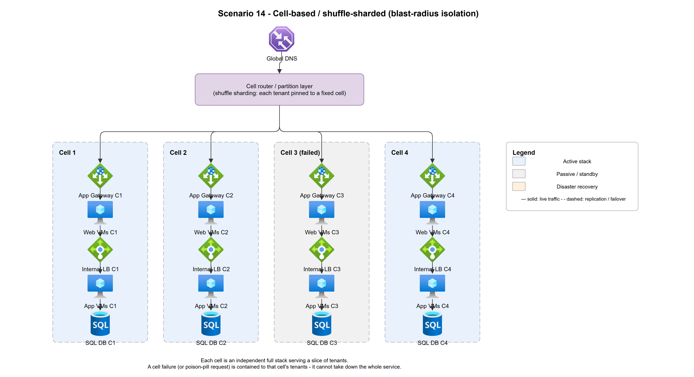

Instead of one big shared stack, the workload is split into independent **cells**,
each a self-contained full stack serving a fixed slice of tenants. A **cell router**
uses **shuffle sharding** to pin each tenant to a cell. A failure (including a
**gray failure or poison-pill request** that active/active alone can't stop) is
contained to that cell's tenants.

| Failover method | RTO | RPO | Target SLO |
|-----------------|-----|-----|-----------|
| **Cell-based isolation**: a failed cell affects only its tenants; the router routes around it. | Near-zero for unaffected cells | Per-cell (as its data tier dictates) | **~99.999%+** with a bounded blast radius |

**Caveat:** this is an *architectural overlay*, usually combined with AZ/region
redundancy (#7-#13), not a substitute for it. It adds routing/partitioning
complexity and requires the app to be cleanly tenant-partitionable.

**When to use:** large multi-tenant SaaS where a single bad deploy, hot tenant, or
poison-pill request must never take down all customers at once.

---

## Decision flow: which topology?

Work top-down from **Start**. Green = *Yes*, grey = *No*. Outcome boxes are
heat-coloured by SLO (red → orange → yellow → green = least → most resilient).

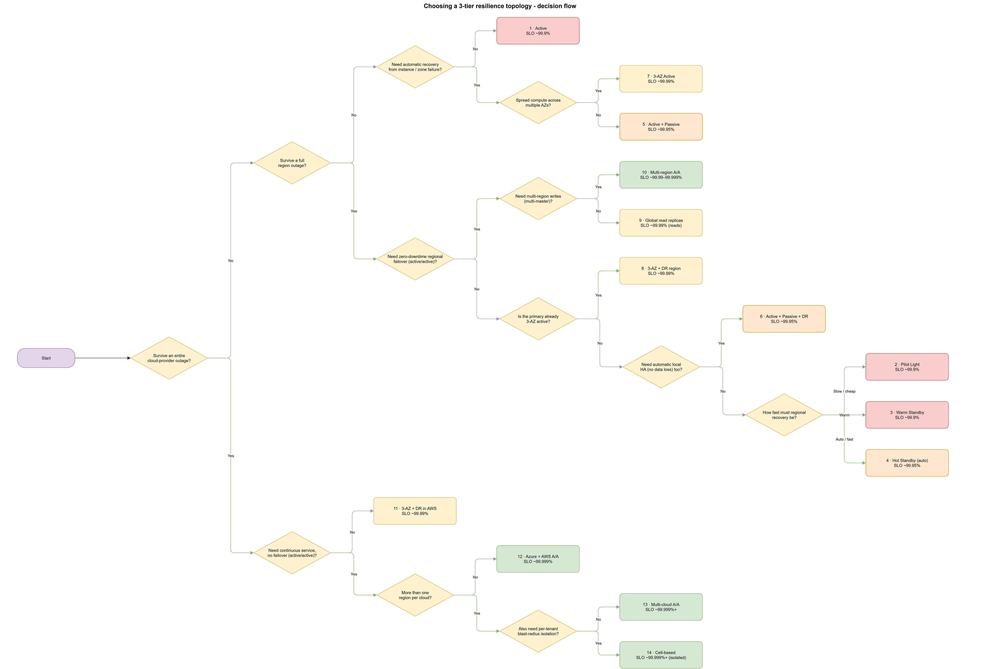

The flow asks, in order: can you tolerate a provider-wide outage, then a region
outage, then a zone/instance failure, and at each level whether you need
zero-downtime *active/active* (and multi-master writes) or can accept a *failover*
event (and how fast it must be: pilot light → warm → hot). The leaf you land on is
the recommended scenario, with its target SLO.

---

## Summary comparison

| # | Topology | Failover method | RTO | RPO | Target SLO | Cost / Complexity | Protects against |
|---|----------|-----------------|-----|-----|-----------|-------------------|------------------|
| 1  | [Active](#1--active-single-site)                     | Backup & Restore (manual)         | Hours       | Hours       | ~99.9%       | `$` · Low         | (nothing, baseline) |
| 2  | [Active + DR: Pilot Light](#2--active--dr-pilot-light)   | Data replicated, compute dormant  | 30 min-hrs  | Sec-min     | ~99.9%       | `$$` · Low        | Region loss (cheapest) |
| 3  | [Active + DR: Warm Standby](#3--active--dr-warm-standby)  | Small always-on DR, DNS failover  | 15 min-~1 h | Sec-min     | ~99.9%       | `$$` · Low-Med    | Region loss (faster) |
| 4  | [Active + DR: Hot Standby](#4--active--dr-automatic-hot-standby)   | Full standby, **auto** failover   | Sec-min     | Sec-min     | ~99.95%      | `$$$` · Medium    | Region loss (automatic) |
| 5  | [Active + Passive](#5--active--passive-local-ha)           | Auto hot-standby (local, sync)    | Sec-min     | ≈ 0         | ~99.95%      | `$$` · Medium     | Instance / stack failure |
| 6  | [Active + Passive + DR](#6--active--passive--dr)      | Local auto + warm DR              | Sec-min     | ≈0 / sec    | ~99.95%      | `$$$` · Medium    | Instance + region loss |
| 7  | [Active ×3 AZ](#7--active-across-3-availability-zones-1-region)               | Active/Active across AZ (auto)    | Seconds     | ≈ 0         | ~99.99%      | `$$` · Medium     | Zone failure |
| 8  | [3 AZ + DR region](#8--3-az-active--dr-region-also-3-az-active)           | Auto AZ + warm 3-AZ DR            | Sec-min     | ≈0 / sec    | ~99.99%      | `$$$` · Med-High  | Zone + region loss |
| 9  | [Global read replicas](#9--single-writer-global-read-replicas-write-global--read-local)       | Single-writer, read-local         | Reads ~0 · writes min | Seconds | ~99.99% (reads) | `$$$` · Medium | Region loss for reads (no write conflicts) |
| 10 | [Multi-region active/active](#10--multi-region-activeactive-3-az-per-region) | Active/Active multi-site          | Near-zero   | Seconds     | ~99.99-99.999% | `$$$$` · High   | Region loss (transparent) |
| 11 | [3 AZ + DR in AWS](#11--azure-3-az-active--dr-in-aws-cross-cloud)           | Auto AZ + cross-cloud DR          | Sec-min     | ≈0 / sec    | ~99.99%      | `$$$$` · High     | Zone + region + **provider** loss |
| 12 | [Azure + AWS active/active](#12--activeactive-across-azure--aws-3-az-each)  | Active/Active multi-cloud         | Near-zero   | Seconds     | ~99.999%     | `$$$$$` · Very High | Region + **provider** loss |
| 13 | [2×Azure + 2×AWS, all active](#13--multi-cloud-multi-region-all-active)| Active/Active ×4, two clouds      | Near-zero   | Seconds     | ~99.999%+    | `$$$$$` · Very High | Region + provider loss (max) |
| 14 | [Cell-based / shuffle-shard](#14--cell-based--shuffle-sharded-blast-radius-isolation) | Blast-radius isolation (overlay)  | Near-zero (per cell) | Per cell | ~99.999%+  | `$$$$` · High     | Gray failures / poison pills / noisy tenants |

> Cost/Complexity is relative: `$` ≈ one stack to run; `$$$$$` ≈ four active
> stacks across two clouds with global data consistency and four-way operations.

### Choosing a tier

- **Cost & complexity rise sharply** down the table; only buy the resilience the
  business case requires.
- **Sync replication (RPO≈0)** is only practical within a metro/region (#5-#8
  intra-AZ). Cross-region and cross-cloud are **async** → accept seconds of RPO.
- **Regional DR is a ladder** (#2 → #3 → #4): pilot light is cheapest/slowest,
  hot standby is priciest/automatic. Pick the rung your RTO justifies.
- **Data strategy is a separate axis:** single-writer read replicas (#9) trade
  write-region failover for zero conflict handling; active/active (#10+) eliminates
  the failover event but moves the hard problem to **conflict resolution**.
- **Cell-based (#14) is an overlay**, not a rung; layer it on #7-#13 to bound the
  blast radius of gray failures and bad deploys.
- A topology's SLO is only as good as its **weakest serial tier** and your
  **tested runbooks**: an untested DR region is an aspiration, not an SLO.

---

## Cross-cutting concerns (what the ladder doesn't show)

The ladder above scales resilience to **infrastructure** loss (instance → zone →
region → provider). These concerns cut across every rung and decide whether the
SLO you designed is the SLO you actually get.

- **DR is not backup — protect the *other* axis too.** Every rung from Hot
  Standby (#4) up replicates data faithfully, which means it also replicates a
  `DROP TABLE`, a ransomware encryption, or a bad-deploy data mutation to every
  region in seconds. Failover protects against **infrastructure** loss; only
  **point-in-time, immutable, or air-gapped backups** protect against **logical**
  loss (corruption, deletion, malicious action). They are orthogonal axes: you
  need backups at *every* tier, not just at #1. Active/active is the *worst*
  defence against corruption, not the best, because it spreads it fastest.

- **Detection and triggering cap your real RTO.** The RTO clock starts when the
  failure is *detected*, not when it happens. A health-probe interval, a flapping
  threshold, and a human paging decision all sit in front of every "minutes"
  figure above. **Automatic** failover is faster but risks **false-positive
  cutovers** (flapping) that cause their own outage; **manual** failover avoids
  that but adds detection-to-decision time. Design the probe and the trigger, not
  just the target.

- **Failover is only half the runbook — plan failback.** Every scenario covers
  cutting *over*; returning to the primary is often harder and riskier: you must
  reverse replication, reconcile writes that landed on the DR side, and re-sync
  without a second outage. An untested failback can strand you in the DR region
  or lose data on the way home.

- **Correlated failure — "multi-region" can share a single fate.** Two regions
  are only independent if everything *around* them is. A shared DNS provider,
  identity plane (Entra ID / IAM), TLS/cert authority, container registry,
  secrets store, or **management / control plane** is a single dependency that can
  take down both sides at once. In particular, even on VMs a **regional
  control-plane outage** can block scaling, deploys, and failover *while your
  instances keep serving traffic* — the same failure mode the
  [PaaS companion](paas-failover-methods.md) calls out. Map your shared
  dependencies before you trust your region count.

- **Split-brain — who decides to promote?** Automatic promotion (#4–#6) can
  **double-promote** under a network partition, leaving two writers that silently
  diverge. Guard promotion with a **quorum / witness / tiebreaker**, and prefer an
  **odd number** of fault domains so a majority always exists.

- **DNS TTL vs. real RTO.** Scenarios that fail over by **re-pointing DNS** (#2,
  #3, #8, #11) inherit client- and resolver-cached TTLs: the true RTO is your
  promotion time *plus* the record TTL (plus resolvers that ignore it). Keep
  failover-record TTLs low (30–60 s), or use a **global anycast load balancer /
  health-based routing** so cutover doesn't wait on DNS propagation.

- **Test it, or it's a hope, not an SLO.** An untested DR path decays silently —
  capacity drifts, credentials expire, the runbook goes stale. Run scheduled
  **failover drills / game days**, exercise **failback** as well as failover, and
  test the **control plane** (can you actually *trigger* a failover during a
  regional management outage?), not just the data plane. Feed the measured
  detection-to-recovery time back into the RTO numbers above.
