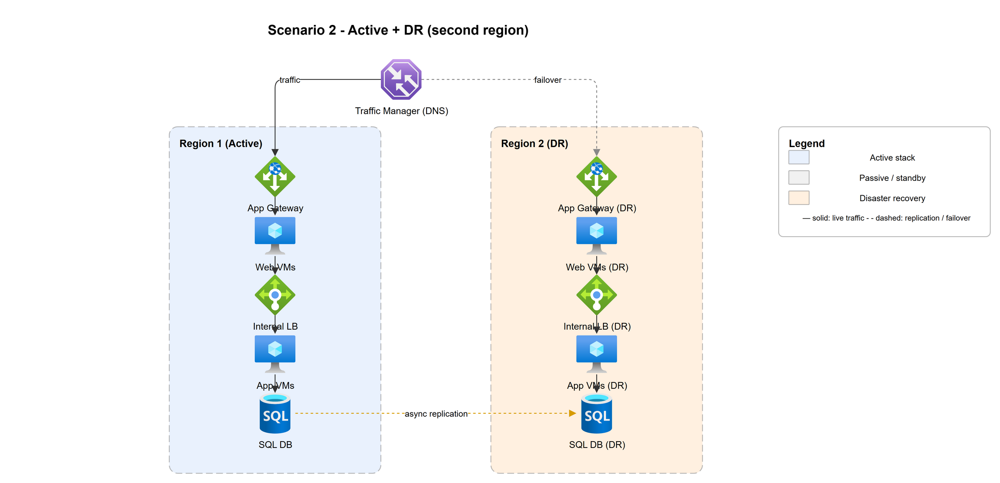
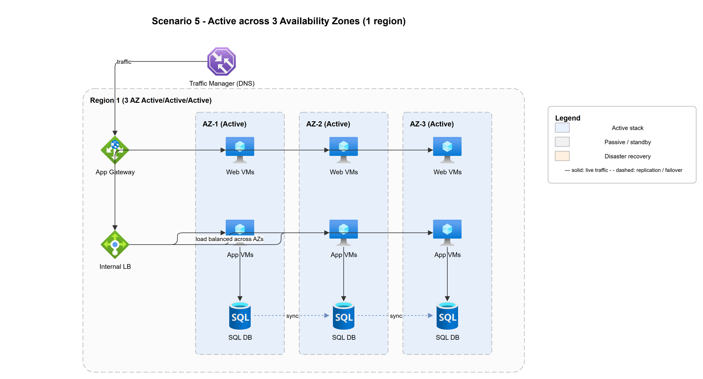
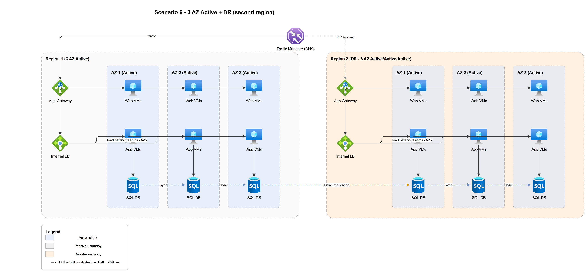
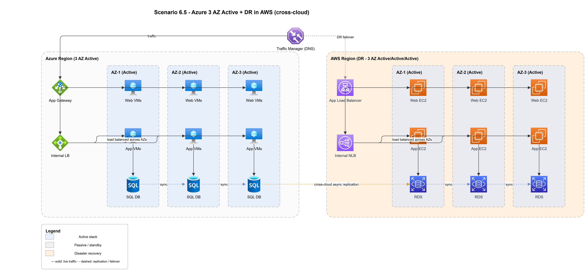
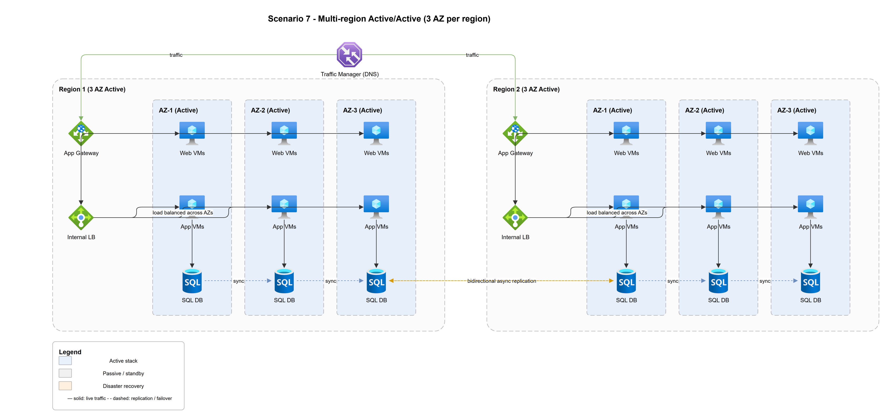
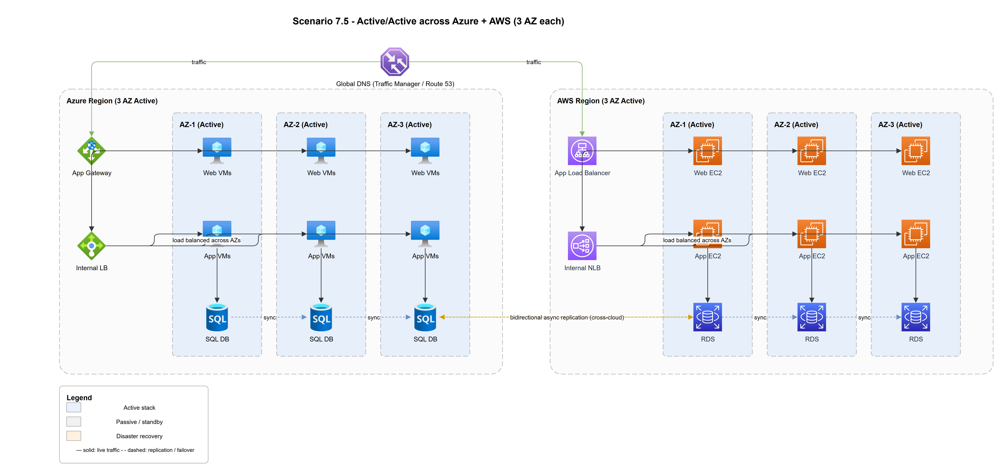
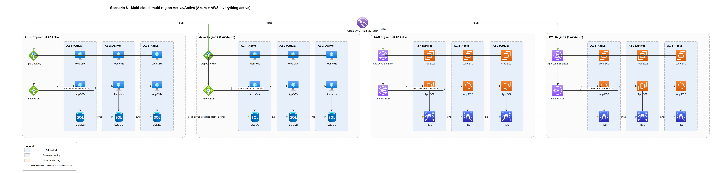
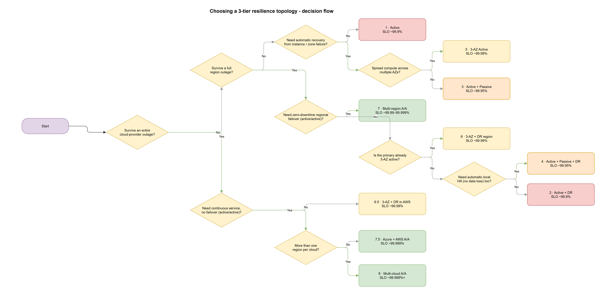

# Failover Methods & Service-Level Objectives (SLO)

A walk-through of the ten 3-tier reference architectures in [out/](out/), the
**failover method** each one uses, and the **availability SLO / RTO / RPO** you
can realistically target with it.

> The numbers below are **illustrative design targets**, not contractual SLAs.
> Your actual SLO is bounded by each cloud's component SLAs (compute, load
> balancer, database, DNS) and your operational maturity. Treat them as a
> relative ladder: each step buys more resilience at more cost and complexity.

---

## Key terms

| Term | Meaning |
|------|---------|
| **SLO** | Service-Level Objective — the availability you *aim* to deliver (e.g. 99.99%). |
| **SLA** | Service-Level Agreement — the contractual promise (usually a notch below your SLO). |
| **RTO** | Recovery Time Objective — how long the app can be **down** during a failure before it's back. |
| **RPO** | Recovery Point Objective — how much **data** (measured in time) you can afford to lose. |
| **Failover** | Shifting traffic/work from a failed component to a healthy one. |
| **Sync replication** | Data committed to replicas before acknowledging → RPO ≈ 0, but latency-bound (same metro / AZ). |
| **Async replication** | Data shipped to replicas after commit → RPO > 0 (seconds–minutes), works over long distance. |

### Availability "nines" → downtime budget

| SLO | Downtime / year | Downtime / month |
|-----|-----------------|------------------|
| 99.0%   | 3.65 days   | 7.3 hours  |
| 99.9%   | 8.77 hours  | 43.8 min   |
| 99.95%  | 4.38 hours  | 21.9 min   |
| 99.99%  | 52.6 min    | 4.38 min   |
| 99.999% | 5.26 min    | 26 sec     |

### Availability math (why redundancy helps)

- **Serial dependency** (every tier must be up): multiply the tiers →
  `A_total = A_web × A_app × A_db`. More tiers in series *lowers* availability.
- **Parallel redundancy** (N identical instances, any one suffices): the *failure*
  probabilities multiply → `A = 1 − (1 − A_instance)^N`. This is where AZs and
  regions earn their nines.

### The failover ladder (DR patterns)

From cheapest/slowest to most expensive/fastest:

1. **Backup & Restore** — rebuild from backups after an outage. Slow RTO, lossy RPO.
2. **Pilot Light** — core data replicated, minimal standby; scale up on failover.
3. **Warm Standby** — a smaller always-on copy; scale up and cut over.
4. **Active / Passive (hot standby)** — full standby, automatic health-based failover.
5. **Active / Active (multi-site)** — all sites serve traffic; a "failover" is just
   removing an unhealthy endpoint — effectively zero RTO.

### How to read the diagrams

- **Solid arrows** = live traffic. **Dashed arrows** = replication / failover paths.
- **Blue** = active, **grey** = passive/standby, **amber** = disaster-recovery site.
- Flow in every stack: `Front LB → Web → Internal LB → App → Database`.

---

## 1 · Active (single site)

A single full stack in one region. **No redundancy** — the baseline.

| Failover method | RTO | RPO | Target SLO |
|-----------------|-----|-----|-----------|
| **Backup & Restore** — redeploy stack and restore the DB from backup. Entirely manual. | Hours (rebuild + restore) | Last backup: 1–24 h | **~99.9%** (capped by single instances) |

**When to use:** dev/test, internal tools, anything where hours of downtime and
some data loss are acceptable. Any single failure (VM, AZ, region) is an outage.

---

## 2 · Active + DR (second region)

Primary region serves traffic; a **DR region** holds a standby stack kept current
by **async replication**. Traffic Manager fails traffic over on a regional outage.

| Failover method | RTO | RPO | Target SLO |
|-----------------|-----|-----|-----------|
| **Pilot Light / Warm Standby** — DNS-based regional failover, manual or scripted promotion of the DR database. | 15 min – few hours (promote DB, scale up, re-point DNS) | Seconds–minutes (async lag) | **~99.9%** app, plus regional disaster protection |

**When to use:** you must survive losing an entire region but can tolerate a short,
mostly-manual cutover and a few seconds of data loss.

---

## 3 · Active + Passive (local HA)

Two stacks in the **same region**: one active, one hot standby. **Synchronous**
replication keeps the standby identical; failover is **automatic** on health-probe
failure.

| Failover method | RTO | RPO | Target SLO |
|-----------------|-----|-----|-----------|
| **Active/Passive (hot standby)** — LB / cluster health probe auto-promotes the passive node. | Seconds – a few minutes (automatic) | ≈ 0 (sync) | **~99.95%** |

**When to use:** you need automatic recovery from instance/stack failure with no
data loss, but a single region is acceptable. Does **not** protect against a
whole-region outage.

---

## 4 · Active + Passive + DR

Combines local automatic HA (active/passive, sync) **with** a DR region (async).
Two independent layers of protection.

| Failover scope | Method | RTO | RPO |
|----------------|--------|-----|-----|
| Local (instance/stack) | Active/Passive auto-failover (sync) | Seconds–minutes | ≈ 0 |
| Regional (whole region lost) | Warm-standby DR, DNS failover | Minutes | Seconds |

**Target SLO: ~99.95%** for everyday failures, with regional-disaster coverage.

**When to use:** business apps that need automatic local HA *and* a documented
regional recovery path, without paying for full multi-region active/active.

---

## 5 · Active across 3 Availability Zones (1 region)

One region, three AZs, **all active**. Zone-redundant load balancers spread the
web and app tiers across AZs; the database replicates **synchronously** between
zones. A zone failure is handled automatically — the LB just stops sending to it.

| Failover method | RTO | RPO | Target SLO |
|-----------------|-----|-----|-----------|
| **Active/Active across zones** — health-based LB removal of the failed AZ; no promotion step. | Seconds (automatic) | ≈ 0 (sync across AZ) | **~99.99%** |

**When to use:** the standard production baseline in a single region. Survives a
full-AZ outage with near-zero impact. Still exposed to a *region-wide* failure.

---

## 6 · 3 AZ Active + DR region (also 3 AZ active)

Scenario 5, plus a **second region that is itself a full 3-AZ active deployment**
held as DR (amber). Intra-region failures are absorbed automatically; a whole-region
loss triggers a regional failover with the DR region already warm.

| Failover scope | Method | RTO | RPO |
|----------------|--------|-----|-----|
| Zone failure | Active/Active across AZ (auto) | Seconds | ≈ 0 |
| Region failure | DNS failover to warm 3-AZ DR region | Minutes | Seconds (async cross-region) |

**Target SLO: ~99.99%** with strong regional-disaster protection (DR is fully
zone-redundant, so it's not a degraded fallback).

**When to use:** tier-1 apps that need both everyday zone resilience and a
credible, capacity-matched recovery region.

---

## 6.5 · 3 AZ Active (Azure) + DR in AWS — cross-cloud

Same shape as #6, but the DR region lives in a **different cloud provider**
(Azure primary → AWS DR). Adds protection against a **provider-wide** outage or
account-level issue, at the cost of cross-cloud data replication and dual tooling.

| Failover scope | Method | RTO | RPO |
|----------------|--------|-----|-----|
| Zone failure (Azure) | Active/Active across AZ (auto) | Seconds | ≈ 0 |
| Cloud/region failure | Cross-cloud failover to AWS 3-AZ DR | Minutes | Seconds (cross-cloud async) |

**Target SLO: ~99.99%**, plus resilience to a single-provider catastrophe.

**When to use:** regulatory or risk requirements demand independence from any one
cloud provider. Expect higher network egress cost, latency, and operational
complexity (two platforms, two skill sets, data-sovereignty review).

---

## 7 · Multi-region Active/Active (3 AZ per region)

Two regions, **both serving live traffic**, each internally 3-AZ active. A global
load balancer distributes users; data replicates **bidirectionally (async)**.
There is no "failover" in the classic sense — a failed region is simply removed
from rotation.

| Failover method | RTO | RPO | Target SLO |
|-----------------|-----|-----|-----------|
| **Active/Active multi-site** — global LB drops the unhealthy region; surviving region carries the load. | Near-zero (sub-minute) | Seconds (async lag) | **~99.99% – 99.999%** |

**Caveat:** bidirectional async replication means **write conflicts are possible**
— you need conflict resolution (last-writer-wins, CRDTs, partitioned ownership)
or a single-writer model. Capacity-plan so one region can absorb 100% of load.

**When to use:** global, latency-sensitive, high-revenue services that cannot
tolerate a regional outage even briefly.

---

## 7.5 · Active/Active across Azure + AWS (3 AZ each)

Scenario 7 spanning **two different clouds**: a 3-AZ active region in Azure and a
3-AZ active region in AWS, both live behind a global DNS. Survives the loss of an
entire cloud provider with no failover event.

| Failover method | RTO | RPO | Target SLO |
|-----------------|-----|-----|-----------|
| **Active/Active multi-cloud** — global DNS removes the failed cloud; the other serves everything. | Near-zero | Seconds (cross-cloud async) | **~99.999%** |

**Caveat:** all the multi-region conflict concerns of #7, **plus** cross-cloud
network latency, egress cost, and the challenge of keeping two platform stacks
truly equivalent (IAM, networking, managed-DB semantics differ).

**When to use:** the rare app where a single-provider outage is an unacceptable
business risk and the cost of true multi-cloud parity is justified.

---

## 8 · Multi-cloud, multi-region, all active

The maximum-resilience topology: **two active regions in each of Azure and AWS**
(four active 3-AZ deployments), everything live, global DNS distribution, and
global async replication across all of them.

| Failover method | RTO | RPO | Target SLO |
|-----------------|-----|-----|-----------|
| **Active/Active, four sites, two clouds** — any region or cloud can drop out and the rest carry on. | Near-zero | Seconds | **~99.999%+** |

**Caveat:** highest cost and operational burden. Global data consistency,
conflict handling, capacity headroom (any single site failing must not overload
the rest), and four-way deployment/observability are all hard problems. Only a
handful of workloads justify this.

**When to use:** global tier-0 platforms where downtime is measured in seconds of
lost revenue and regulatory/risk posture mandates cloud independence.

---

## Decision flow — which topology?

Work top-down from **Start**. Green = *Yes*, grey = *No*. Outcome boxes are
heat-coloured by SLO (red → orange → yellow → green = least → most resilient).

The flow asks, in order: can you tolerate a provider-wide outage, then a region
outage, then a zone/instance failure — and at each level whether you need
zero-downtime *active/active* or can accept a *failover* event. The leaf you land
on is the recommended scenario, with its target SLO.

---

## Summary comparison

| # | Topology | Failover method | RTO | RPO | Target SLO | Cost / Complexity | Protects against |
|---|----------|-----------------|-----|-----|-----------|-------------------|------------------|
| 1   | Active                     | Backup & Restore (manual)        | Hours       | Hours       | ~99.9%       | `$` · Low        | (nothing — baseline) |
| 2   | Active + DR                | Pilot light / warm standby (DNS) | 15 min–hrs  | Sec–min     | ~99.9%       | `$$` · Low–Med   | Region loss (slow) |
| 3   | Active + Passive           | Auto hot-standby (local)         | Sec–min     | ≈ 0         | ~99.95%      | `$$` · Medium    | Instance / stack failure |
| 4   | Active + Passive + DR      | Local auto + warm DR             | Sec→min     | ≈0 / sec    | ~99.95%      | `$$$` · Medium   | Instance + region loss |
| 5   | Active ×3 AZ               | Active/Active across AZ (auto)   | Seconds     | ≈ 0         | ~99.99%      | `$$` · Medium    | Zone failure |
| 6   | 3 AZ + DR region           | Auto AZ + warm 3-AZ DR           | Sec→min     | ≈0 / sec    | ~99.99%      | `$$$` · Med–High | Zone + region loss |
| 6.5 | 3 AZ + DR in AWS           | Auto AZ + cross-cloud DR         | Sec→min     | ≈0 / sec    | ~99.99%      | `$$$$` · High    | Zone + region + **provider** loss |
| 7   | Multi-region active/active | Active/Active multi-site         | Near-zero   | Seconds     | ~99.99–99.999% | `$$$$` · High  | Region loss (transparent) |
| 7.5 | Azure + AWS active/active  | Active/Active multi-cloud        | Near-zero   | Seconds     | ~99.999%     | `$$$$$` · Very High | Region + **provider** loss |
| 8   | 2×Azure + 2×AWS, all active| Active/Active ×4, two clouds     | Near-zero   | Seconds     | ~99.999%+    | `$$$$$` · Very High | Region + provider loss (max) |

> Cost/Complexity is relative: `$` ≈ one stack to run; `$$$$$` ≈ four active
> stacks across two clouds with global data consistency and four-way operations.

### Choosing a tier

- **Cost & complexity rise sharply** down the table; only buy the resilience the
  business case requires.
- **Sync replication (RPO≈0)** is only practical within a metro/region (#3–#6
  intra-AZ). Cross-region and cross-cloud are **async** → accept seconds of RPO.
- **Active/active eliminates the failover event** (and its RTO risk) but moves the
  hard problem to **data consistency / conflict resolution**.
- A topology's SLO is only as good as its **weakest serial tier** and your
  **tested runbooks** — an untested DR region is an aspiration, not an SLO.
