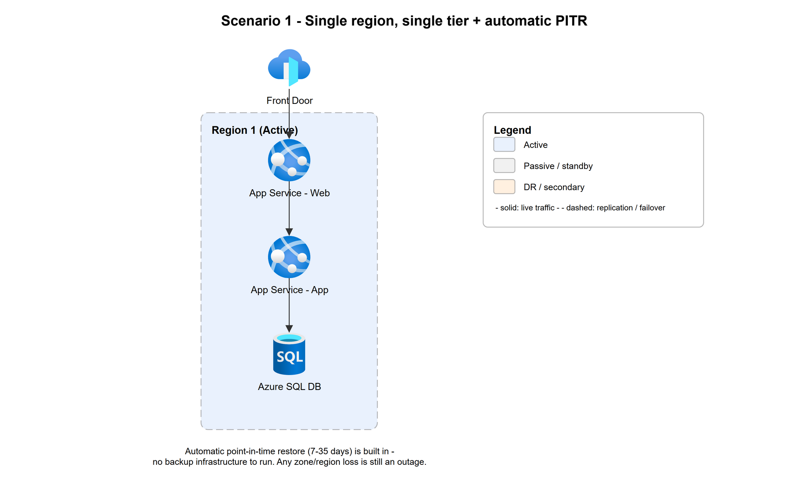
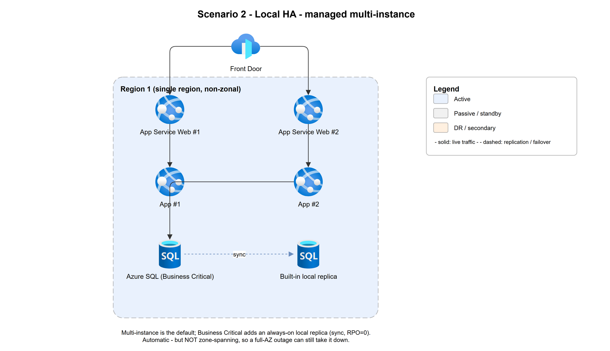
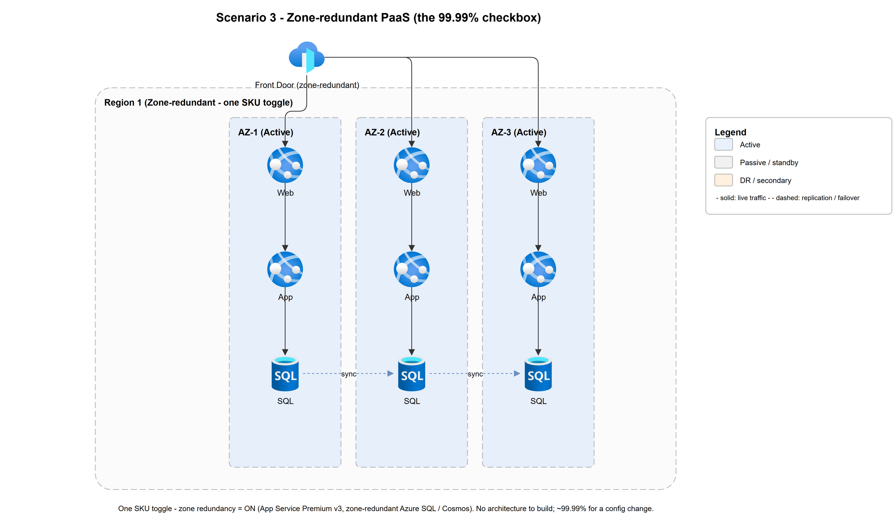
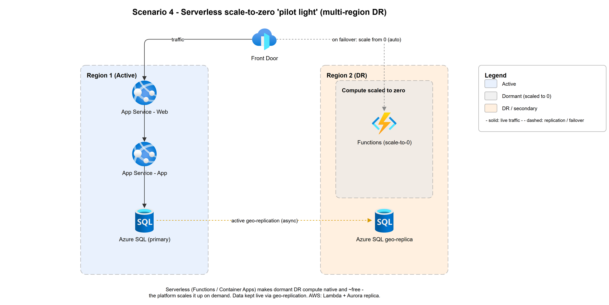
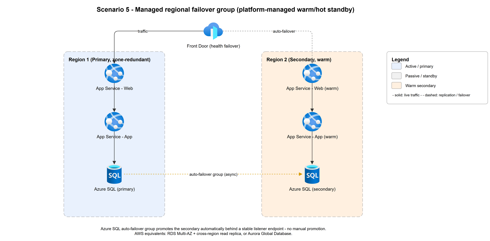
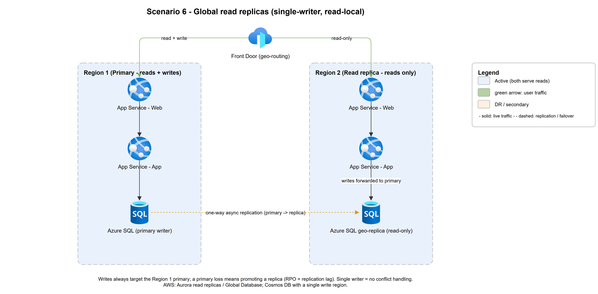
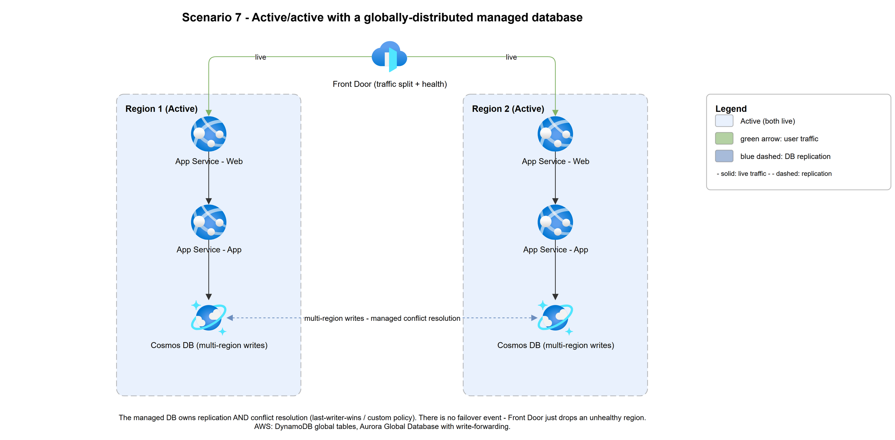
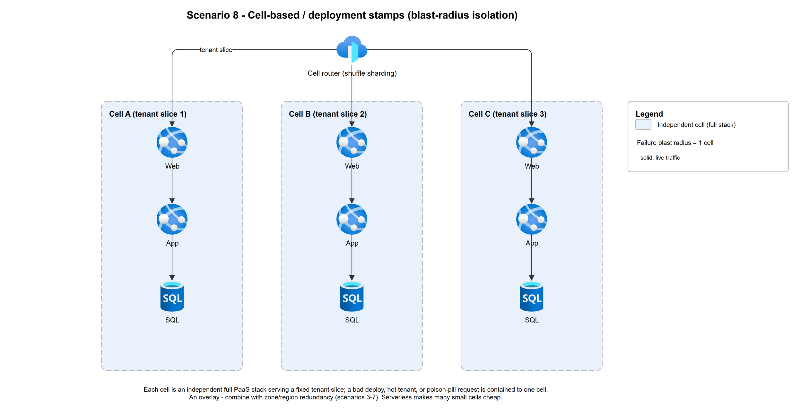
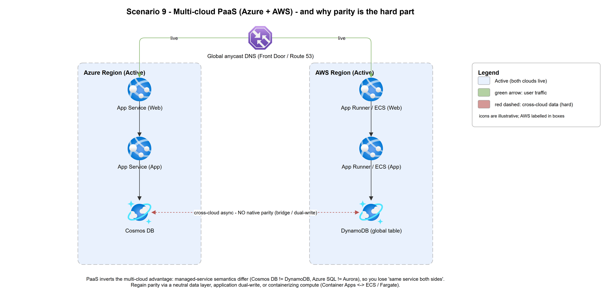
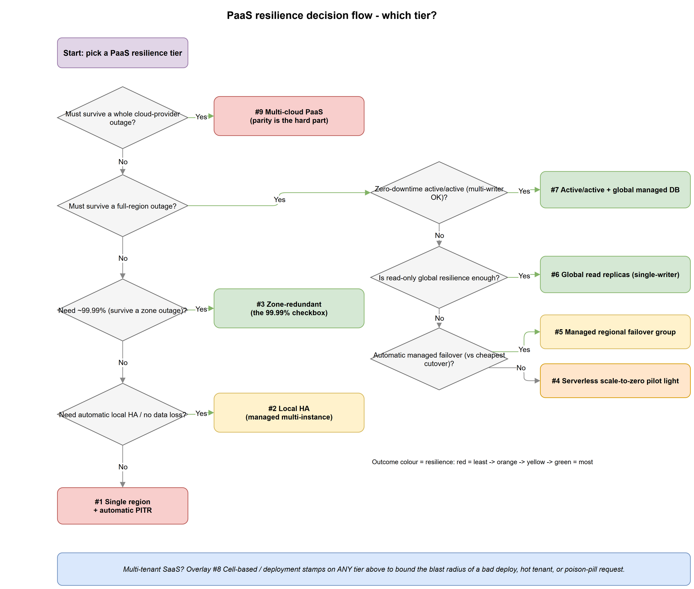

# PaaS Failover Methods & Service-Level Objectives (SLO)

The companion to [README.md](README.md). That document builds resilience out of
**VMs and infrastructure you assemble**. This one asks the same question of a
3-tier app built on **managed Platform-as-a-Service (PaaS) building blocks**:
App Service, Functions, Azure SQL, Cosmos DB, Front Door, where most resilience
is a **SKU tier plus a configuration toggle** and the platform owns the failover.

> The numbers below are **illustrative design targets**, not contractual SLAs.
> Your actual SLO is bounded by each service's component SLA and your operational
> maturity. Treat them as a relative ladder: each rung buys more resilience at
> more cost and complexity.

Azure services are named first; **AWS equivalents are noted alongside**. The
patterns are provider-neutral.

---

## What changes when you move from VM to PaaS

The failover *ladder* is the same shape, but the work moves. In the VM world you
**build** redundancy; in PaaS you mostly **buy and enable** it. Seven shifts
matter:

| Shift | VM world | PaaS world |
|-------|----------|------------|
| **Resilience as config** | You architect LBs, health probes, replication, promotion. | Zone redundancy, backups, failover groups are **toggles / SKU features**. 99.99% can be a checkbox. |
| **SKU / tier gating** | Any resilience if you build it. | The feature is **locked behind a tier**: zone-redundant App Service needs Premium v3; a local replica needs Azure SQL Business Critical. No tier, no feature. |
| **Platform-managed failover** | You script promotion and DNS cutover. | Auto-failover groups / global tables **promote and re-point for you** behind a stable endpoint. |
| **Cold start replaces provisioning** | "Pilot light" = minutes to boot VMs. | Serverless **scales from zero automatically**, but the first request pays a **cold-start** latency, and warm-up/pre-provisioned plans cost money. |
| **Shared control-plane blast radius** | Your VMs keep running if the portal is down. | A **regional control-plane outage** can block scaling, deploys, and failover *even while your instances serve traffic*. New failure mode. |
| **Regional service parity** | A VM SKU is a VM SKU. | A given PaaS **tier/feature may not exist in your DR region** (or has different limits/quotas). Verify before you design. |
| **Shifted shared-responsibility line** | You patch, back up, replicate. | The provider does; you own **configuration correctness, capacity/quota, and tested runbooks**. The failure moves from "did it break" to "did we enable it right". |

The upshot: in PaaS several VM rungs **collapse into a setting**, so this document
consolidates the fourteen VM scenarios into **nine PaaS scenarios** (plus the
cell-based overlay). Where a rung merges, the mapping is called out.

### 3-tier → PaaS building blocks

| Tier | Azure (primary) | AWS (equivalent) |
|------|-----------------|------------------|
| **Global edge / routing** | Front Door, Traffic Manager | CloudFront, Global Accelerator, Route 53 |
| **Web** | App Service, Static Web Apps | S3 + CloudFront, Amplify, App Runner |
| **App** | App Service, Functions, Container Apps | Lambda, Fargate/ECS, App Runner |
| **Relational data** | Azure SQL Database | RDS, Aurora |
| **Global / NoSQL data** | Cosmos DB | DynamoDB (global tables) |
| **Regional DB failover** | Auto-failover groups, active geo-replication | RDS Multi-AZ + cross-region replica, Aurora Global |

---

## Key terms

| Term | Meaning |
|------|---------|
| **SLO / SLA** | Objective you *aim* for vs the contractual promise (usually a notch lower). |
| **RTO** | Recovery Time Objective: how long the app can be **down** before it's back. |
| **RPO** | Recovery Point Objective: how much **data** (in time) you can afford to lose. |
| **SKU / tier gating** | A resilience feature only exists on a higher service tier (e.g. zone redundancy on Premium v3, local replica on Business Critical). |
| **Failover group** | A managed grouping (Azure SQL) that replicates to a secondary and **auto-promotes** it behind a stable listener endpoint. |
| **Cold start** | The latency penalty when serverless compute scales up from zero. The PaaS analogue of "provisioning time". |
| **Control-plane outage** | The management/API layer of a region fails: you can't scale, deploy, or trigger failover even if running instances are healthy. |
| **Sync / async replication** | Sync → RPO ≈ 0 but latency-bound (same metro/region); async → RPO > 0 (seconds), works over distance. |

### Availability "nines" → downtime budget

| SLO | Downtime / year | Downtime / month |
|-----|-----------------|------------------|
| 99.0%   | 3.65 days   | 7.3 hours  |
| 99.9%   | 8.77 hours  | 43.8 min   |
| 99.95%  | 4.38 hours  | 21.9 min   |
| 99.99%  | 52.6 min    | 4.38 min   |
| 99.999% | 5.26 min    | 26 sec     |

### How to read the diagrams

- **Solid arrows** = live traffic (green where reads/writes are called out). **Dashed arrows** = replication / failover.
- **Blue** = active, **grey** = passive / dormant (scaled to zero), **amber** = DR / secondary, **red dashed** = cross-cloud data (the hard path).
- Flow in every stack: `Front Door → App Service (Web) → App Service / Functions (App) → managed DB`.

---

## The PaaS resilience ladder

Nine scenarios, cheapest/least-resilient first, mapped back to the VM document:

| # | PaaS scenario | Merges VM # | One-line headline |
|---|---------------|-------------|-------------------|
| 1 | Single region + automatic PITR | 1 | Baseline, but backups & RTO are better **for free** |
| 2 | Local HA (managed multi-instance) | 5 | Multi-instance is the default, not something you build |
| 3 | Zone-redundant (the 99.99% checkbox) | 5, 7 | Near-99.99% is a **SKU toggle**, not architecture |
| 4 | Serverless scale-to-zero pilot light | 2 | Dormant DR compute is native and ~free |
| 5 | Managed regional failover group | 3, 4, 6, 8 | Platform owns DB promotion + health failover |
| 6 | Global read replicas (single-writer) | 9 | Conflict-free read-local resilience |
| 7 | Active/active + global managed DB | 10 | Conflict handling **offloaded to the managed DB** |
| 8 | Cell-based / deployment stamps | 14 | Blast-radius overlay; cheaper per-cell with serverless |
| 9 | Multi-cloud PaaS | 11, 12, 13 | PaaS makes multi-cloud **harder**, no service parity |

---

## 1 · Single region, single tier + automatic PITR

One region, one instance per tier: Front Door → App Service (Web) → App Service
(App) → Azure SQL. **No redundancy**, the baseline. The PaaS twist: **automatic
point-in-time restore** (Azure SQL: 7-35 days; every managed DB has an
equivalent) means even the do-nothing tier starts with better backup RPO and a
faster, scripted restore than VM backup-and-restore, with **zero backup
infrastructure to run**.

| Failover method | RTO | RPO | Target SLO | Min tier |
|-----------------|-----|-----|-----------|----------|
| **Point-in-time restore**: redeploy the app (IaC) and restore the DB to a timestamp. | Minutes to hours (redeploy + restore) | Down to seconds (continuous backup) | **~99.9%** (single instances) | Any |

**When to use:** dev/test, internal tools, anything where hours of downtime is
acceptable. Any zone or region failure is still an outage.
**AWS:** RDS/Aurora automated backups + PITR; app on App Runner / Elastic Beanstalk.

---

## 2 · Local HA: managed multi-instance (single region, non-zonal)

The same single region, but the platform runs **multiple instances by default**.
An App Service plan scales the Web and App tiers across several instances behind
its built-in load balancer, and **Azure SQL Business Critical** keeps an
always-on **local replica** (sync, RPO ≈ 0). Failure of an instance is handled
automatically: there is nothing to promote.

| Failover method | RTO | RPO | Target SLO | Min tier |
|-----------------|-----|-----|-----------|----------|
| **Managed multi-instance**: platform reschedules failed instances; Business Critical auto-fails the DB to its local replica. | Seconds (automatic) | ≈ 0 (sync local replica) | **~99.9-99.95%** | App Service Standard+; SQL Business Critical |

**When to use:** you want automatic recovery from instance/hardware failure with
no data loss, and a single region is acceptable. **Caveat:** unless the plan is
zone-redundant (next rung), all instances can sit in **one availability zone**;
a full-AZ outage still takes you down.
**AWS:** Multi-instance ECS/Fargate service or Elastic Beanstalk; RDS Multi-AZ (single-AZ standby off).

---

## 3 · Zone-redundant PaaS: the 99.99% checkbox

The signature PaaS move. Turn **zone redundancy ON** and the platform spreads
every tier across three availability zones and replicates the database
synchronously between them. A zone failure is absorbed automatically: the load
balancer just stops sending to it. In the VM world (README #7) this was a
multi-box, multi-subnet build; here it is **one setting on a supported SKU**.

| Failover method | RTO | RPO | Target SLO | Min tier |
|-----------------|-----|-----|-----------|----------|
| **Zone-redundant (config toggle)**: LB removes the failed AZ; zone-redundant DB stays available. | Seconds (automatic) | ≈ 0 (sync across AZ) | **~99.99%** | App Service **Premium v3**; zone-redundant Azure SQL / Cosmos |

**When to use:** the standard production baseline in a single region. Merges VM
#5 and #7. Survives a full-AZ outage with near-zero impact; still exposed to a
**region-wide** failure.
**Caveat (PaaS-specific):** the feature is **tier-gated**: zone redundancy
requires the premium tier, and it must be enabled **at create time** for some
resources. Confirm it's available in your region.
**AWS:** Multi-AZ by default for ALB + Fargate across subnets in 3 AZs; RDS/Aurora Multi-AZ.

---

## 4 · Serverless scale-to-zero "pilot light" (multi-region DR)

The cheapest way to hold a real second region. The DR region keeps the **data
tier live** via active geo-replication, while compute is **serverless and scaled
to zero**: Functions or Container Apps cost ~nothing until traffic arrives, then
the platform **scales them up on demand**. This is README #2 (pilot light) made
native: there is no fleet to provision, so cutover is faster and largely
automatic.

| Failover method | RTO | RPO | Target SLO | Min tier |
|-----------------|-----|-----|-----------|----------|
| **Serverless pilot light**: on failover, Front Door routes to the DR region; serverless compute scales from zero; promote the geo-replica. | ~1-15 min (cold start + DB promote) | Seconds (async geo-replication) | **~99.9%** app + regional protection | Consumption/serverless compute; geo-replicated DB |

**When to use:** you must survive losing a region at the lowest standing cost and
can tolerate a short, mostly-scripted cutover with a cold-start penalty.
**Caveat:** **cold start** is the new provisioning time: budget it into RTO, or
pay for pre-warmed/pre-provisioned instances (which erodes the "free" part).
**AWS:** Lambda (scales from zero) + Aurora cross-region replica / DynamoDB.

---

## 5 · Managed regional failover group (platform-managed warm/hot standby)

A full second region kept current by async replication, with the **database
promotion handled by the platform**. An **Azure SQL auto-failover group**
replicates to the secondary and, on failure, **promotes it automatically behind
a stable listener endpoint**: the app's connection string never changes.
Front Door health-probes both regions and fails traffic over. This single rung
absorbs README's Warm Standby (#3), Hot Standby (#4), Active+Passive+DR (#6), and
the DR half of #8, because the manual promotion those diagrams show is now the
platform's job.

| Failover method | RTO | RPO | Target SLO | Min tier |
|-----------------|-----|-----|-----------|----------|
| **Managed failover group**: auto-promote secondary DB behind a listener; Front Door health-fails traffic over. | Seconds to minutes (automatic) | Seconds (async cross-region) | **~99.95%** | Azure SQL (failover groups); pre-deployed or serverless secondary compute |

**When to use:** business apps that need **automatic** regional recovery without
building promotion logic, and don't need full active/active. Make the primary
zone-redundant (#3) so everyday failures never trigger a regional event.
**Caveat:** async → non-zero RPO; and the secondary region must have **quota and
capacity** ready. A failover into an under-provisioned region just moves the
outage.
**AWS:** RDS Multi-AZ + cross-region read replica with promotion, or **Aurora Global Database** (managed cross-region promotion).

---

## 6 · Global read replicas (single-writer, read-local)

Multiple regions serve **reads** locally; **all writes go to one primary**. Data
flows **one-way** (primary → replicas, async). Managed read replicas
(Azure SQL geo-replicas, Aurora read replicas, or Cosmos DB with a **single write
region**) make this the conflict-free alternative to active/active: read-scaling
and read-local latency **without** multi-master write conflicts.

| Failover method | RTO | RPO | Target SLO | Min tier |
|-----------------|-----|-----|-----------|----------|
| **Single-writer + read replicas**: reads survive a region loss instantly; a primary loss requires **promoting a replica** to writer. | Reads: near-zero · Writes: minutes (promote) | Seconds (replication lag) | **~99.99% for reads** | Geo-replica-capable DB tier |

**When to use:** read-heavy global apps (catalogs, feeds, dashboards) that want
low-latency local reads and regional read resilience but can keep a single write
region. Mirrors README #9.
**Caveat:** losing the primary means a **write outage** until a replica is
promoted, and any un-replicated writes are lost (RPO = lag). No conflict handling
because there is only ever one writer.
**AWS:** Aurora read replicas / Global Database; DynamoDB with a single write region.

---

## 7 · Active/active with a globally-distributed managed database

Both regions serve live traffic; Front Door distributes users and drops any
unhealthy region. The hard part of active/active, **multi-master write
conflicts**, is **offloaded to the managed database**: Cosmos DB
**multi-region writes** (with a conflict-resolution policy), DynamoDB **global
tables**, or Aurora Global with write-forwarding. There is no "failover" event;
a lost region is simply removed from rotation. Mirrors README #10.

| Failover method | RTO | RPO | Target SLO | Min tier |
|-----------------|-----|-----|-----------|----------|
| **Active/active + global DB**: global LB drops the unhealthy region; the managed DB replicates and resolves conflicts. | Near-zero (sub-minute) | Seconds (async) | **~99.99-99.999%** | Multi-region-write DB (Cosmos / DynamoDB / Aurora Global) |

**When to use:** global, latency-sensitive, high-revenue services that cannot
tolerate even a brief regional outage.
**Caveat:** you still own the **conflict-resolution policy** (last-writer-wins vs
custom) and its business consequences: the platform automates the mechanism, not
the semantics. Capacity-plan so one region can absorb 100% of load.
**AWS:** DynamoDB global tables, or Aurora Global Database with write-forwarding.

---

## 8 · Cell-based / deployment stamps (blast-radius isolation)

Instead of one shared stack, the workload is split into independent **cells**
(Azure's *deployment stamps* pattern), each a self-contained PaaS stack serving a
fixed slice of tenants. A **cell router** uses shuffle sharding to pin each tenant
to a cell, so a failure (including a **gray failure or poison-pill request** that
active/active alone can't stop) is contained to that cell's tenants. Serverless
per-cell compute makes running **many small cells** affordable. Mirrors README #14.

| Failover method | RTO | RPO | Target SLO | Min tier |
|-----------------|-----|-----|-----------|----------|
| **Cell-based isolation**: a failed cell affects only its tenants; the router routes around it. | Near-zero for unaffected cells | Per-cell (as its data tier dictates) | **~99.999%+** with a bounded blast radius | Any (overlay) |

**When to use:** large multi-tenant SaaS where a bad deploy, hot tenant, or
poison-pill request must never take down all customers at once.
**Caveat:** an **overlay**, not a rung; layer it on #3-#7. It adds
routing/partitioning complexity and requires a cleanly tenant-partitionable app.
**AWS:** the same stamps pattern with API Gateway/ALB routing + per-cell ECS/Lambda + DynamoDB.

---

## 9 · Multi-cloud PaaS (Azure + AWS): why parity is the hard part

Two active stacks, one per cloud, behind global anycast DNS. This is where PaaS
**inverts** the VM story. In README #11-#13 the DR side ran the *same* stack on
another cloud's VMs. In PaaS the managed services **don't have equivalents**:
Cosmos DB ≠ DynamoDB, Azure SQL ≠ Aurora, and their consistency, indexing, and
failover semantics differ. You lose the "same service both sides" benefit exactly
where you need it most, the data tier, so multi-cloud is **harder** on PaaS,
not easier. This one rung stands in for README #11, #12, and #13.

| Failover method | RTO | RPO | Target SLO | Min tier |
|-----------------|-----|-----|-----------|----------|
| **Active/active multi-cloud**: global DNS removes the failed cloud; the other serves everything. | Near-zero | Seconds (cross-cloud async) | **~99.999%** | Portable/containerized compute + a cross-cloud data strategy |

**When to use:** regulatory or risk requirements demand independence from any one
provider, and the cost of parity is justified.
**Caveat (the whole point):** regaining parity means one of: a **cloud-neutral
data layer** (self-managed Postgres/Kafka on both), **application-level
dual-write** (and its consistency headaches), or **containerizing compute**
(Container Apps ↔ ECS/Fargate) so at least the app tier is portable. Expect higher
egress cost, cross-cloud latency, and two operational skill sets.
**AWS side:** App Runner/ECS + DynamoDB; **Azure side:** App Service/Container Apps + Cosmos DB.

---

## Decision flow: which tier?

Work top-down from **Start**. Green = *Yes*, grey = *No*. Outcome boxes are
heat-coloured by resilience (red → orange → yellow → green = least → most).

The flow asks, in order: must you survive a whole-**provider** outage, then a
**region** outage, then a **zone** outage, and within the region-survival branch
whether you need zero-downtime **active/active** (and multi-master writes), can
accept **read-only** global resilience, or want **automatic managed failover**
versus the cheapest serverless cutover. The leaf you land on is the recommended
scenario. **Cell-based (#8) is an overlay** you can add to any tier.

---

## Summary comparison

| # | PaaS topology | Failover method | RTO | RPO | Target SLO | Min tier / SKU | Cost | Protects against |
|---|---------------|-----------------|-----|-----|-----------|----------------|------|------------------|
| 1 | [Single region + PITR](#1--single-region-single-tier--automatic-pitr) | Point-in-time restore | Min-hrs | Seconds (continuous backup) | ~99.9% | Any | `$` | (nothing, baseline) |
| 2 | [Local HA (multi-instance)](#2--local-ha-managed-multi-instance-single-region-non-zonal) | Managed multi-instance + local replica | Seconds | ≈ 0 | ~99.9-99.95% | Standard+ / SQL Business Critical | `$$` | Instance / hardware failure |
| 3 | [Zone-redundant](#3--zone-redundant-paas-the-9999-checkbox) | Config toggle across 3 AZ | Seconds | ≈ 0 | ~99.99% | **Premium v3** / zone-redundant DB | `$$` | Zone failure |
| 4 | [Serverless pilot light](#4--serverless-scale-to-zero-pilot-light-multi-region-dr) | Scale-from-zero DR + geo-replica | 1-15 min | Seconds | ~99.9% + regional | Serverless compute + geo-replica | `$$` | Region loss (cheapest) |
| 5 | [Managed failover group](#5--managed-regional-failover-group-platform-managed-warmhot-standby) | Auto-promote DB + health failover | Sec-min | Seconds | ~99.95% | Azure SQL failover groups | `$$$` | Region loss (automatic) |
| 6 | [Global read replicas](#6--global-read-replicas-single-writer-read-local) | Single-writer, read-local | Reads ~0 · writes min | Seconds | ~99.99% (reads) | Geo-replica DB | `$$$` | Region loss for reads (no conflicts) |
| 7 | [Active/active + global DB](#7--activeactive-with-a-globally-distributed-managed-database) | Global LB + multi-region-write DB | Near-zero | Seconds | ~99.99-99.999% | Cosmos / DynamoDB / Aurora Global | `$$$$` | Region loss (transparent) |
| 8 | [Cell-based / stamps](#8--cell-based--deployment-stamps-blast-radius-isolation) | Blast-radius isolation (overlay) | Near-zero (per cell) | Per cell | ~99.999%+ | Any (overlay) | `$$$$` | Gray failures / poison pills / noisy tenants |
| 9 | [Multi-cloud PaaS](#9--multi-cloud-paas-azure--aws-why-parity-is-the-hard-part) | Active/active across clouds | Near-zero | Seconds | ~99.999% | Portable compute + cross-cloud data | `$$$$$` | Region + **provider** loss |

> Cost is relative: `$` ≈ one small plan; `$$$$$` ≈ two active stacks across two
> clouds with a cross-cloud data strategy.

### Choosing a tier

- **The big PaaS win is #3:** for most apps, ~99.99% is a **SKU + toggle**, not a
  project. Reach for it before building anything bespoke.
- **The failover ladder collapsed:** README's pilot-light → warm → hot progression
  (#2→#3→#4) is mostly **one managed failover group (#5)** now; pick it unless
  cost forces you down to the serverless pilot light (#4).
- **Data strategy is still the real decision:** single-writer read replicas (#6)
  trade a write-region failover for **zero conflict handling**; active/active (#7)
  removes the failover event but makes you own a **conflict-resolution policy**.
- **Mind the tier gates and quotas:** a resilience feature you didn't pay the SKU
  for, or a DR region without capacity, is an SLO you don't actually have.
- **New failure mode:** a regional **control-plane** outage can freeze scaling,
  deploys, and failover even while instances run. Multi-region (#5+) is your
  hedge, and **test failover** on the control plane, not just the data plane.
- **Cell-based (#8) is an overlay**, not a rung; layer it on #3-#7 to bound the
  blast radius of gray failures and bad deploys.
- A topology's SLO is only as good as its **weakest serial tier** and your
  **tested runbooks**: an untested failover group is an aspiration, not an SLO.

---

## Cross-cutting concerns (what the ladder doesn't show)

The ladder scales resilience to **infrastructure** loss, and the platform owns
most of the mechanism. These concerns cut across every rung and are the parts
**you still own** — they decide whether the SLO you *enabled* is the SLO you get.

- **DR is not backup — the platform replicates your mistakes too.** Auto-failover
  groups, global tables, and geo-replication faithfully copy a `DROP TABLE`, a
  ransomware encryption, or a bad-deploy mutation to every region in seconds.
  Managed replication protects against **infrastructure** loss; only
  **point-in-time restore, immutable / soft-delete backups, or a retained copy**
  protect against **logical** loss. PITR (#1) isn't the bottom rung you leave
  behind — it's an **orthogonal protection you keep at every tier**. The more
  automatic your replication, the faster corruption spreads.

- **Detection and triggering still cap RTO.** Even with platform-managed failover,
  the RTO clock starts at **detection**. Front Door health-probe intervals,
  failover-group grace periods, and any human confirmation sit in front of every
  "seconds to minutes" above. Auto-failover is faster but can **flap**; a
  conservative grace period is safer but adds minutes. Tune the probe and the
  failover policy, don't just enable them.

- **Failover is half the runbook — plan failback.** After the primary region
  returns, a failover group must be **re-established in the original direction**
  and any diverged writes reconciled. The platform automates promotion, not the
  decision to fail *back* or the data reconciliation. Rehearse the return trip.

- **Correlated failure — managed doesn't mean independent.** Your two regions
  share a **control plane** (a regional management-plane outage can block scaling,
  deploys, and failover while instances still serve — see
  [What changes](#what-changes-when-you-move-from-vm-to-paas)), plus a shared
  identity plane (Entra ID / IAM), DNS, and often a single Front Door /
  Traffic Manager profile. A dependency that lives in one place is a single fault
  domain no SKU tier fixes. Map them.

- **Split-brain — the platform's promotion needs a tiebreaker too.** A failover
  group promoted during a network partition can leave two writers. Managed
  services mitigate this, but understand your service's **quorum / arbitration**
  model before you trust automatic promotion, and prefer configurations with a
  clear majority.

- **DNS TTL vs. real RTO.** The PaaS stacks route through **Front Door / global
  anycast**, which cuts over without waiting on DNS propagation — one reason their
  RTO is tighter than the VM equivalents. But front them with **Traffic Manager
  (DNS-based)** instead and real RTO becomes promotion time **plus the record
  TTL** (plus resolvers that ignore it). Prefer anycast routing, or keep TTLs low.

- **Test it — enablement is not resilience.** A failover group you never
  triggered, a zone-redundant SKU you enabled but never lost a zone under, a DR
  region without reserved quota: all are aspirations until exercised. Run
  scheduled **failover drills / game days**, test **failback**, and specifically
  test the **control plane** (can you fail over during a regional management
  outage?), not just the data plane.
